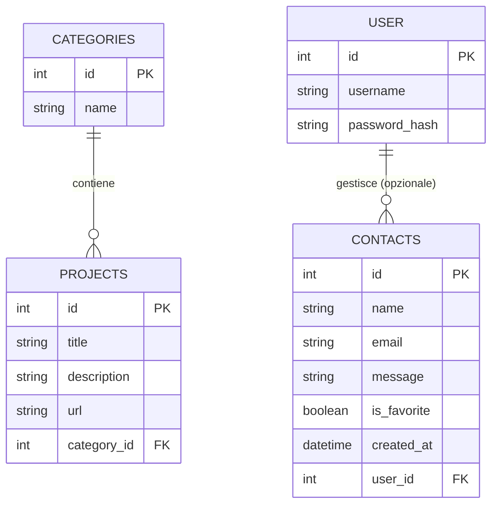
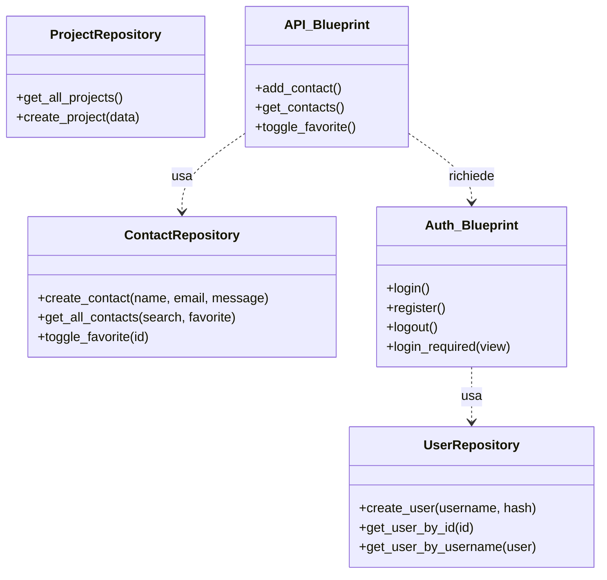
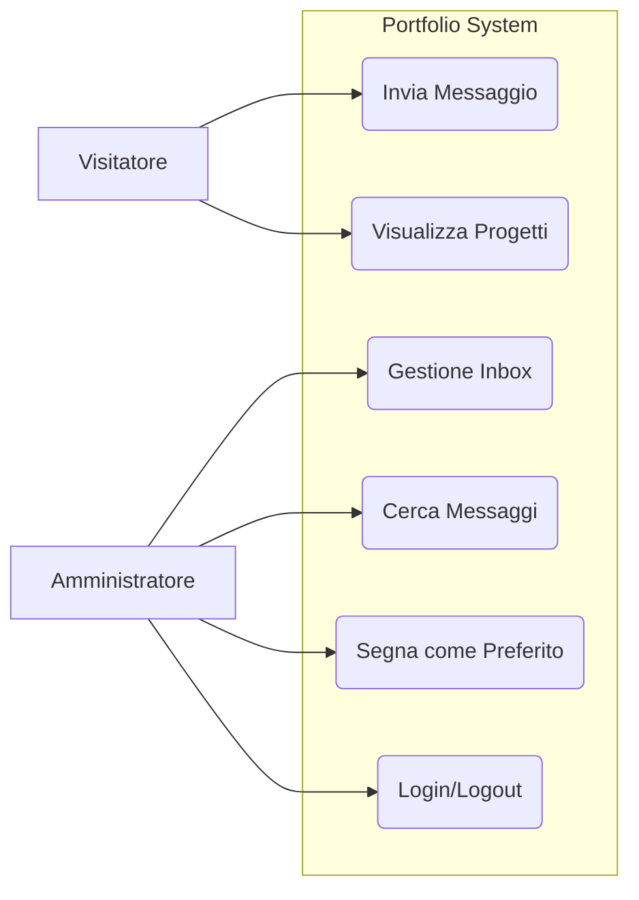

# Documentazione Tecnica - Portfolio Backend

Questa documentazione descrive l'architettura, il database e i casi d'uso del progetto Portfolio Backend, sviluppato con il modulo `03_Sviluppo_Web_e_Database`.

## 1. Diagramma ER (Schema Database)

Il database SQLite è composto da quattro tabelle principali con relazioni per gestire i messaggi, i contenuti e l'accesso sicuro.

## 2. Diagramma UML delle Classi

L'applicazione segue il **Repository Pattern**. Tutte le rotte sono protette tramite il blueprint di autenticazione.

## 3. Casi d'Uso

Il sistema prevede due attori principali: il Visitatore e l'Amministratore del portfolio.

