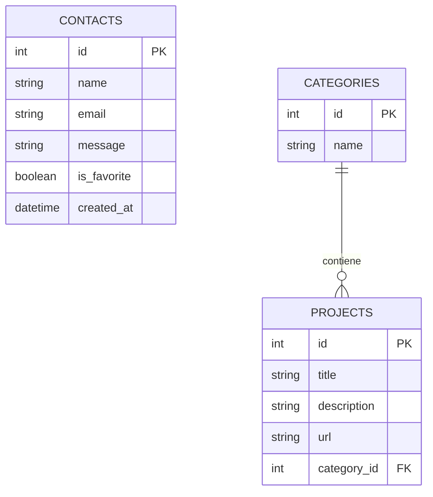
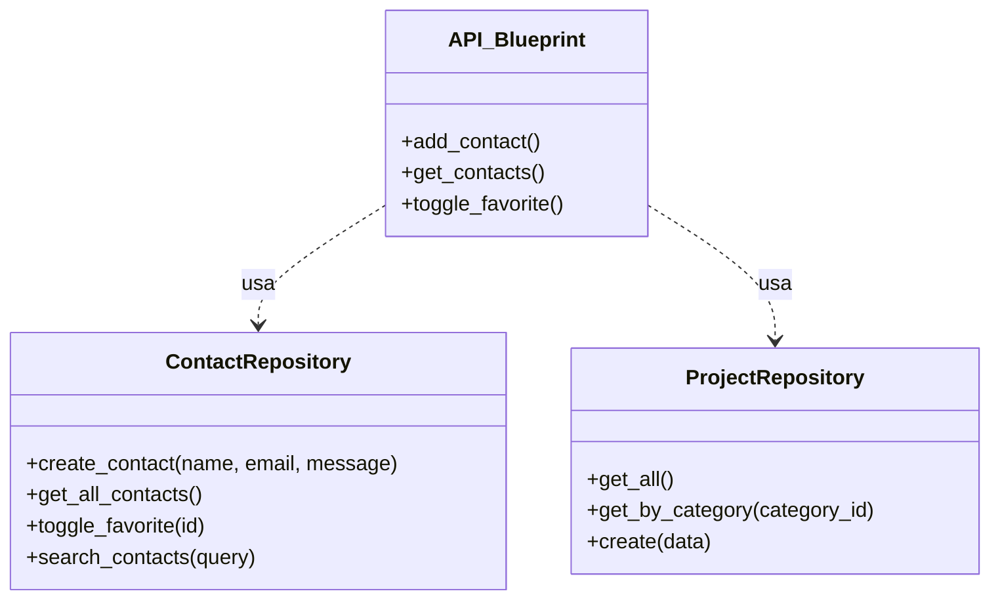

# Documentazione Tecnica - Portfolio Backend

Questa documentazione descrive l'architettura, il database e i casi d'uso del progetto Portfolio Backend, sviluppato per il modulo `03_Sviluppo_Web_e_Database`.

## 1. Diagramma ER (Schema Database)

Il database SQLite è composto da tre tabelle principali per gestire i messaggi ricevuti e i contenuti del portfolio.



## 2. Diagramma UML delle Classi

L'applicazione segue il **Repository Pattern** per separare la logica di accesso ai dati dal controller (Blueprint API).



## 3. Casi d'Uso

Il sistema prevede due attori principali: il Visitatore (utente pubblico) e l'Amministratore (proprietario del portfolio).

```mermaid
useCaseDiagram
    actor "Visitatore" as V
    actor "Amministratore" as A

    package "Portfolio System" {
        usecase "Invia Messaggio" as UC1
        usecase "Visualizza Progetti" as UC2
        usecase "Gestione Inbox" as UC3
        usecase "Cerca Messaggi" as UC4
        usecase "Segna come Preferito" as UC5
    }

    V --> UC1
    V --> UC2
    A --> UC3
    A --> UC4
    A --> UC5
```

> [!NOTE]
> Per semplicità di presentazione in un contesto portfolio, l'accesso amministrativo alla Inbox è attualmente aperto, ma strutturato per essere protetto da un sistema di autenticazione futuro.
