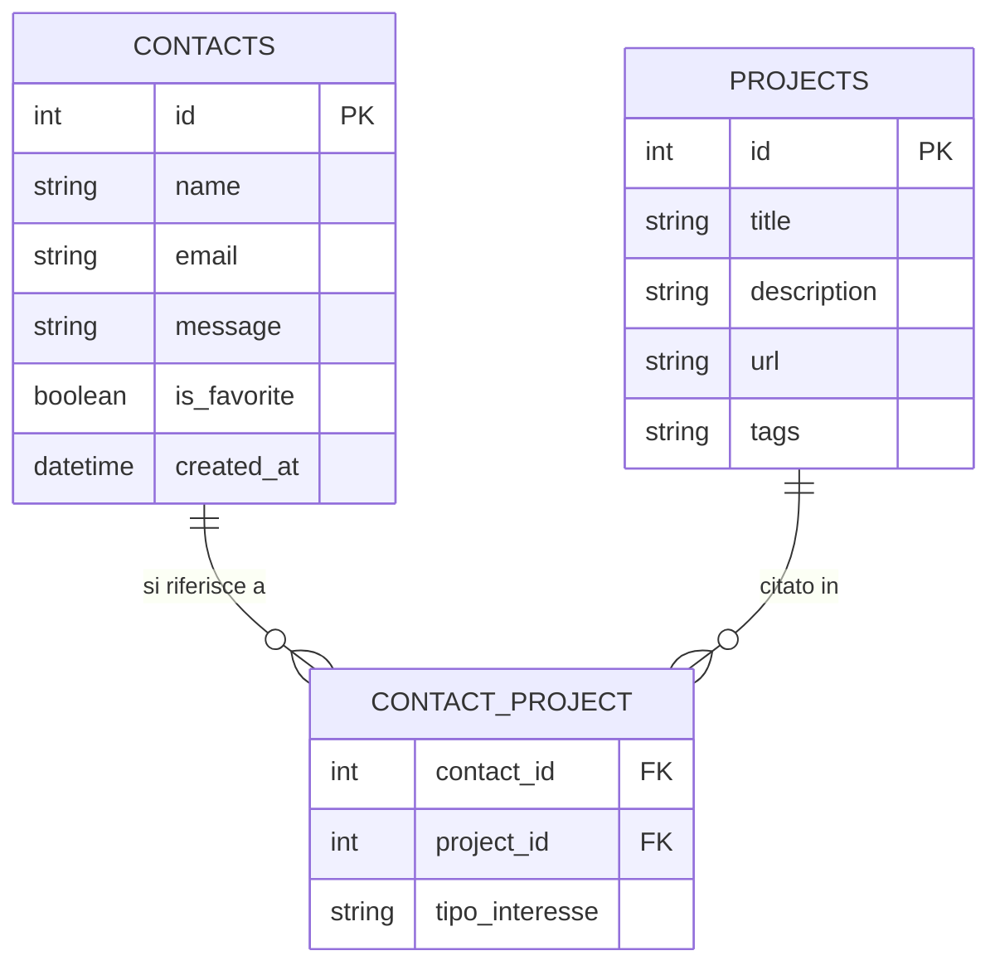
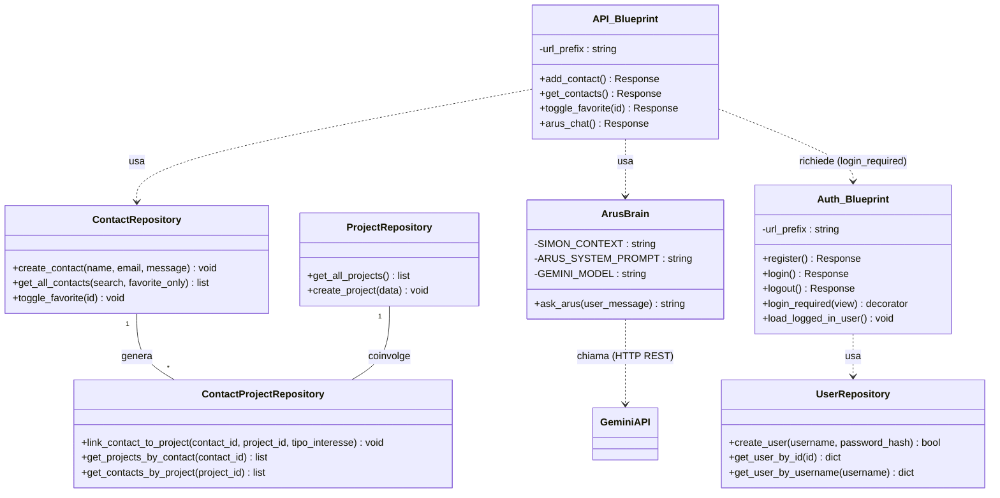
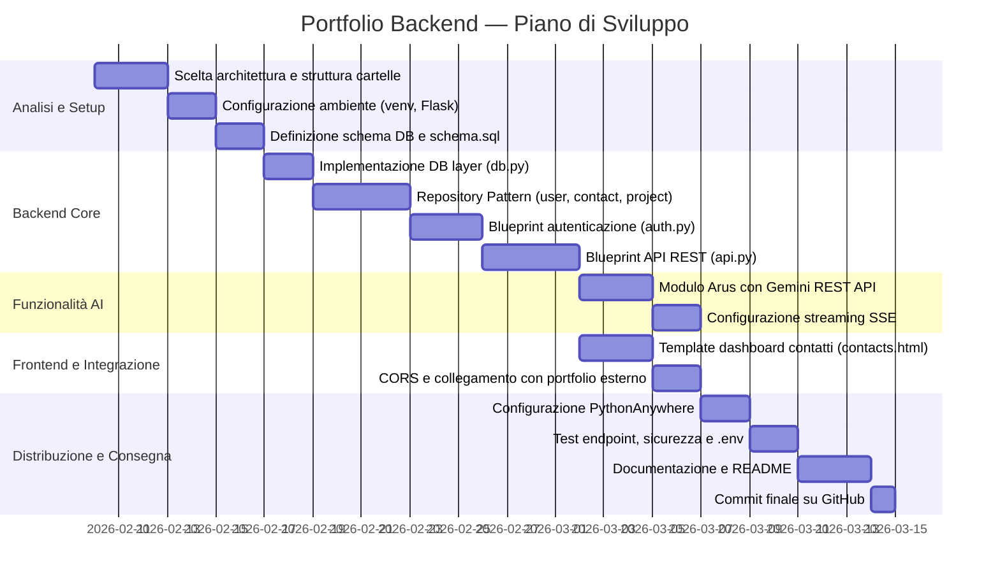

# Documentazione Tecnica — Portfolio Backend

---

## 1. Introduzione

Il progetto è un **backend per portfolio personale** sviluppato con Python e Flask. Espone un'API che consente ai visitatori di inviare messaggi di contatto tramite un form, e permette all'amministratore di consultare e gestire questi messaggi tramite una dashboard protetta da autenticazione.

Il backend è pensato per essere consumato da un frontend separato (es. il portfolio statico su GitHub Pages) ed è strutturato per essere distribuito su PythonAnywhere.

---

## 2. Obiettivi generali

- Permettere a chiunque di inviare un messaggio di contatto tramite form (senza autenticazione).
- Consentire all'amministratore di visualizzare, filtrare e gestire i messaggi ricevuti (Inbox).
- Proteggere la dashboard con un sistema di login basato su sessioni Flask.
- Esporre un endpoint AI (`/api/arus`) per interagire con l'assistente Arus via Gemini.
- Organizzare il codice in modo pulito e scalabile tramite Blueprints e Repository Pattern.

---

## 3. Requisiti funzionali

### Funzionalità principali

1. Invio di un messaggio tramite form con nome, email e testo (`POST /api/contact`).
2. Visualizzazione della lista dei messaggi ricevuti (filtro per testo e preferiti) — richiede login (`GET /api/contacts`).
3. Possibilità di marcare/demarcare un contatto come preferito (`POST /api/contacts/<id>/toggle-favorite`).
4. Autenticazione dell'amministratore (login/logout).
6. Interazione con l'assistente AI Arus tramite endpoint dedicato.

### User stories

- Come **visitatore del portfolio**, voglio inviare un messaggio a Simon compilando un form, in modo che possa essere contattato.
- Come **amministratore**, voglio accedere a una dashboard protetta per leggere i messaggi ricevuti.
- Come **amministratore**, voglio filtrare i messaggi per parola chiave o visualizzare solo i preferiti.
- Come **amministratore**, voglio segnare un messaggio come preferito per trovarlo rapidamente in seguito.
- Come **visitatore**, voglio interagire con l'assistente Arus (AI Assistant) per sapere chi è Simon e cosa sa fare.

---

## 4. Requisiti non funzionali

- Le password degli utenti devono essere memorizzate con hashing sicuro (Werkzeug `generate_password_hash`).
- Il backend deve essere CORS-abilitato per permettere richieste cross-origin dal frontend statico.
- Il codice deve essere organizzato con Flask Blueprints (`auth`, `api`) e Repository Pattern.
- Il progetto deve essere eseguibile localmente con un ambiente virtuale Python (`venv`).
- I dati (messaggi, utenti, progetti) devono essere persistenti su database SQLite.
- Le variabili sensibili (chiavi API, secret key) devono essere gestite tramite file `.env`.

---

## 5. Schema ER (Entità e Relazioni)

Il database è composto da tre entità del dominio. `contacts` raccoglie i messaggi dei visitatori, `projects` contiene i progetti del portfolio. `contact_project` è un'**entità associativa** che le collega: un visitatore può citare uno o più progetti nel suo messaggio, specificando per ciascuno il proprio tipo di interesse (es. collaborazione, bug report, ispirazione).



> `CONTACT_PROJECT` è un'entità associativa con attributo proprio (`tipo_interesse`): descrive il motivo specifico per cui un visitatore cita quel progetto nel suo messaggio. Questo la distingue da una semplice tabella ponte e la rende un'entità del dominio a tutti gli effetti.

---

## 6. Diagramma UML delle Classi

L'applicazione segue il **Repository Pattern**: la logica di accesso al database è separata dalle rotte Flask. I Blueprint `auth` e `api` orchestrano le operazioni delegando al layer dei repository.



---

## 7. Glossario

| Termine | Definizione |
| --- | --- |
| `Blueprint` | Componente Flask che raggruppa rotte e logica in moduli separati (`auth`, `api`). |
| `Repository Pattern` | Architettura che separa l'accesso al DB dal layer delle rotte, rendendolo sostituibile e testabile. |
| `Contact` | Messaggio inviato da un visitatore tramite il form del portfolio (nome, email, testo). |
| `Preferito` | Flag booleano (`is_favorite`) su un contatto, gestibile dalla dashboard. |
| `User` | Account amministratore unico che può accedere alla dashboard protetta. |
| `Project` | Voce del portfolio (titolo, descrizione, link, categoria) esposta tramite API al frontend. |
| `Category` | Raggruppamento tematico dei progetti (es. `Web`, `AI`, `Backend`). |
| `Arus` | Assistente AI integrato nel portfolio. Chiama Google Gemini via HTTP REST e fornisce risposte testuali. |
| `Sessione` | Meccanismo Flask basato su cookie firmati per mantenere l'utente autenticato tra le richieste. |
| `CORS` | Cross-Origin Resource Sharing: configurazione che permette al frontend (GitHub Pages) di chiamare il backend. |
| `.env` | File locale (non versionato) contenente variabili sensibili come `GOOGLE_API_KEY` e `SECRET_KEY`. |

---

## 8. Pianificazione del progetto (Gantt)

Il progetto è stato sviluppato in tre fasi: analisi e setup, implementazione delle funzionalità core, e rifinitura per la distribuzione.



---

## 9. Diagramma dei casi d'uso

Il sistema ha due attori principali: il **Visitatore** (chiunque acceda al portfolio) e l'**Amministratore**. L'Amministratore è una specializzazione del Visitatore: può fare tutto ciò che fa il Visitatore, più le azioni protette da login.

### Diagramma visivo (Mermaid)

```mermaid
graph LR
    V([Visitatore])
    A([Amministratore])

    subgraph PUB["Azioni pubbliche"]
        UC1(Invia messaggio tramite form)
        UC2(Interagisci con Arus (AI Assistant))
    end

    subgraph AUTH["Autenticazione"]
        UC6(Autenticazione)
        UCAUTH{Verifica autenticazione}
    end

    subgraph DASH["Dashboard protetta"]
        UC3(Visualizza inbox)
        UC4(Filtra messaggi)
        UC5(Segna come preferito)
    end

    V --> UC1
    V --> UC2
    A --->|può fare| V
    A --> UC6
    A --> UC3
    A --> UC4
    A --> UC5

    UC3 -. "«include»" .-> UCAUTH
    UC4 -. "«include»" .-> UCAUTH
    UC5 -. "«include»" .-> UCAUTH

    UC4 -. "«extend»" .-> UC3
    UC5 -. "«extend»" .-> UC3
    UC2 -. "«extend»" .-> UC1
```

### Notazione formale (PlantUML)

```plantuml
@startuml uc
left to right direction
actor Visitatore
actor Amministratore
Visitatore <|-- Amministratore

Visitatore --> (Invia messaggio tramite form)
Visitatore --> (Interagisci con Arus (AI Assistant))

Amministratore --> (Autenticazione)
Amministratore --> (Visualizza inbox)
Amministratore --> (Filtra messaggi)
Amministratore --> (Segna come preferito)

(Visualizza inbox)     .> (Verifica autenticazione) : <<include>>
(Filtra messaggi)      .> (Verifica autenticazione) : <<include>>
(Segna come preferito) .> (Verifica autenticazione) : <<include>>

(Filtra messaggi)      .> (Visualizza inbox)            : <<extend>>
(Segna come preferito) .> (Visualizza inbox)            : <<extend>>
(Interagisci con Arus (AI Assistant)) .> (Invia messaggio tramite form) : <<extend>>
@enduml
```

### Relazioni tra casi d'uso

**`<<include>>`** — comportamento obbligatorio sempre eseguito:

- `Visualizza inbox` `<<include>>` `Verifica autenticazione`
- `Filtra messaggi` `<<include>>` `Verifica autenticazione`
- `Segna come preferito` `<<include>>` `Verifica autenticazione`

Tutte le azioni della dashboard richiedono sempre il login: se la sessione non è attiva, il sistema reindirizza automaticamente a `/auth/login`.

**`<<extend>>`** — comportamento opzionale o condizionale:

- `Filtra messaggi` `«extend»` `Visualizza inbox`: filtrare per parola chiave o preferiti è opzionale rispetto alla semplice lettura dell'inbox.
- `Segna come preferito` `«extend»` `Visualizza inbox`: l'azione si attiva durante la consultazione dell'inbox, non è obbligatoria.
- `Interagisci con Arus (AI Assistant)` `«extend»` `Invia messaggio tramite form`: il visitatore può usare l'assistente AI invece (o in alternativa) al form di contatto.

---

> [!NOTE]


